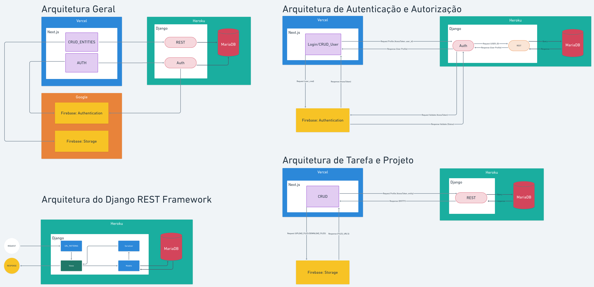
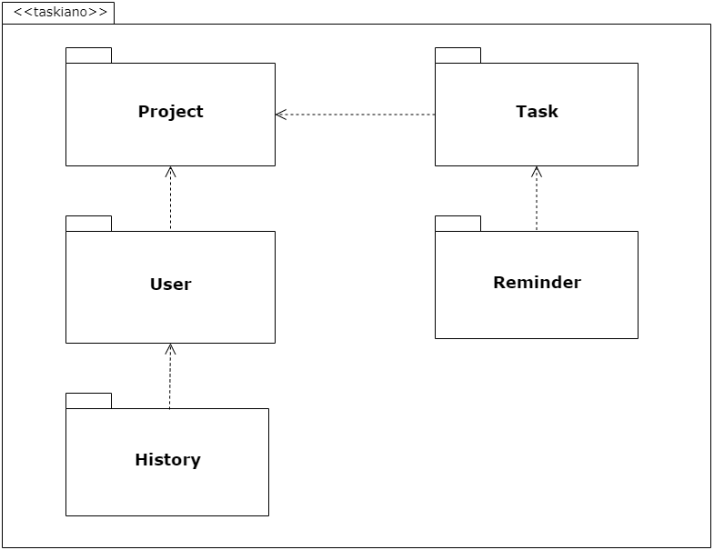

<h1>Taskiano: Projeto Arquitetural do Software</h1>

---

Criado a partir de: [Processo BSI - Projeto Arquitetural](https://docs.google.com/document/d/1i80vPaInPi5lSpI7rk4QExnO86iEmrsHBfmYRy6RDSM/edit)

---

<h2>Sumário</h2>

- [1. Descrição](#1-descrição)
  - [1.1. Histórico de revisões](#11-histórico-de-revisões)
- [2. Visão Geral](#2-visão-geral)
- [3. Requisitos Não Funcionais](#3-requisitos-não-funcionais)
- [4. Mecanismos arquiteturais](#4-mecanismos-arquiteturais)
  - [4.1. Tecnologias](#41-tecnologias)
- [5. Decisões de Design](#5-decisões-de-design)
  - [5.1. Da arquitetura](#51-da-arquitetura)
- [6. Validação com Casos de Teste](#6-validação-com-casos-de-teste)
- [7. Componentes](#7-componentes)
- [8. Implantação](#8-implantação)
- [9. Referências](#9-referências)

## 1. Descrição

Neste documento é abordado a arquitetura da plataforma e suas peculiaridades, tecnologias, decisões de design, implantação, entre outros. Através deste, objetivo atendido é a apresentação do sistema ser realizada de forma que seja possível compreender os aspectos gerais das funcionalidades internas do projeto e suas respectivas finalidades.

### 1.1. Histórico de revisões

| Data       | Versão | Descrição                                       | Autor     |
| ---------- | ------ | ----------------------------------------------- | --------- |
| 05/07/2021 | 1.0    | Documento Inicial                               | Zaú Júlio |
| 05/07/2021 | 1.1    | Organização da estrutura e adição de index      | Zaú Júlio |
| 05/07/2021 | 2.0    | Adição da descrição das tecnologias             | Zaú Júlio |
| 06/07/2021 | 3.0    | Adição da imagem e descrição da arquitetura     | Zaú Júlio |
| 06/07/2021 | 4.0    | Adição da descrição do documento                | Zaú Júlio |
| 06/07/2021 | 5.0    | Conclusão do tópico de Mecanismos arquiteturais | Zaú Júlio |
| 06/07/2021 | 6.0    | Adição do tópico de Decisões de Design          | Zaú Júlio |

## 2. Visão Geral

A arquitetura de microserviços empregada nesse projeto está ilustada na Fiura 1, logo abaixo. O núcleo arquitetural é a camada de interface gráfica com usuário, implementada em Javascript e Typescript com **Next.js**/**React** e hospedada na Vercel.
Esta camada da aplicação comunica-se diretamente com o serviços do Firebase, Authentication e Storage, e com a camada de controle de entidades.

Esta camada por sua vez é implementada em Python através do _meta-framework_ Django REST e hospedada no Heroku, em conjunto com o banco de dados relacional **MariaDB**. A aplicação de controle das entidades também está estreitamente conectada ao serviço de autenticação do Google Firebase. A conexão com o Firebase Authentication fornece mecanismos de autenticação e autorização a aplicação, garantindo a segurança e confiabilidade necessárias para a plataforma.

Figura 1. Imagem que representa a visão geral no documento.

## 3. Requisitos Não Funcionais

**Requisitos não-funcionais:** foi elaborada uma lista de requisitos não funcionais que fazem parte do sistema, descrevendo cada requisito, mostrando sua finalidade e funcionamento para uma boa experiência do usuário final.

<table>
  <td>Requitos</td><td>Descrição</td>
  <tr>
   <td>RNF001
     Design 
    </td>
   <td>
      
 <strong> 1.</strong> O desing do sistema deve ser intuivo e com menus bem organizados em diferentes níveis.
    </td>
  </tr>
  <tr>
   <td>RNF002 Portabilidade</td>
   <td>
    
 <strong> 1. </strong>O software deve ser responsivo e projetado LTS(long-term support), para que tenha suporte por um período de tempo maior que o normal e futuramente dar suporte a plataforma mobile.
    </td>
  </tr>
  <tr>
    <td>RNF003 Interoperabilidade</td>
    <td>
      
 <strong> 1. </strong> O software deve ser desenvolvido com os frameworks Django e NextJs com banco de dados MariaDB server e firebase para autenticação.
    </td>
  </tr>
  <tr>
    <td>RNF004
       Segurança 
     </td>
    <td>
      
 <strong> 1. </strong> O software deve possuir autenticação social para garantir a integridade dos dados de usuário.
    </td>
  </tr>
</table>

## 4. Mecanismos arquiteturais

A seguir está listado os principais mecanismos arquiteturais presentes no sistema, os mecanismos de análise, design e implementação. O intuito desta etapa é verificar e garantir que todas as preocupações técnicas relativas à arquitetura do sistema tenham sido capturadas.

| Mecanismo de Análise                       | Mecanismo de Design                                  | Mecanismo de Implementação      |
| ------------------------------------------ | ---------------------------------------------------- | ------------------------------- |
| Persistência                               | Banco de dados relacional                            | MariaDB Server                  |
| Autenticação                               | **Authentication as service**                        | Google Firebase Authentication  |
| Autenticação Social _is human_             | **Authentication as service**                        | Google Firebase Authentication  |
| Autorização                                | Tokens de autenticação                               | JWT                             |
| Interface interativa 3º grau               | Drag-and-drop                                        | React(react-beautiful-dnd)      |
| Notificações _in browser_                  | Toasts                                               | React(react-hot-toast)          |
| Integração com sistemas legados (Cobrança) | Interface utilizando XML em serviço e arquivo texto. | Web Service e System.IO         |
| Front-End                                  | Interface gráfica de usuário.                        | Next.js/React.                  |
| Back-End                                   | Interface de controle de dados.                      | Django/Django-REST-framework.   |
| Host                                       | Disponibilização da plataforma.                      | Vercel, Heroku, Google Firebase |
|                                            |                                                      |                                 |

### 4.1. Tecnologias

A seguir descrevemos brevemente as principais tecnologias empregadas no desenvolvimento desta aplicação, suas funcionalidades e o papel que desempenham.

| Tecnologias                  | Descrição                                                                                                                                                                                                                                                                                                                                                                               |
| ---------------------------- | --------------------------------------------------------------------------------------------------------------------------------------------------------------------------------------------------------------------------------------------------------------------------------------------------------------------------------------------------------------------------------------- |
| **Typescript**               | O Typescript é um _superset_ criado pela Microsoft que adiciona, principalmente, tipagem ao Javascript. A agregação de tipagem adiciona mais segurança ao código ao oferecer um _error handler_ para controle de tipos, o que consequentemente auxilia o desenvolvedor a criar soluções para o tratamento de exceções.                                                                  |
| **Reactjs**                  | React é uma biblioteca de criação de componentes interativos, criada pelo Facebook, com foco na performance e produtividade. Utilizada para manipular a DOM, estados e contexto encapsulados. Através do princípio de componentes a crescente atomicidade da aplicação auxilia no controle de falhas e consequentemente no aumento da confiabilidade da aplicação.                      |
| **Next.js**                  | O Next.js é um _framework_ construído pela Vercel que envolve o React e agrega diversos recursos como SSR, SSG, otimização de imagens, roteamento, entre vários outros. Com o Next podemos reduzir a quantidade de código JS/TS empregado diretamente na página, expondo assim, cada vez menos a aplicação.                                                                             |
| **MariaDB**                  | O MariaDB Server é um banco de dados relacional SQL, de código aberto, construído a partir de um _fork_ do MySQL. O MariaDB oferece suporte a JSON, versionamento de tabelas, integração com a Oracle, além de todas as demais funcionalidades básicas de um banco de dados.                                                                                                            |
| **Firebase**: Storage        | O Firebase Storage é um _storage as service_ desenvolvido pelo Google, com alta escalabilidade, segurança rígida e integrada ao Firebase Authentication. O serviço oferece _storage_ para objetos independente do formato, áudio, vídeo, imagens, etc. O serviço é integrado ao SDK do Firebase, o que facilita a construção e manipulação da aplicação enquanto garante sua segurança. |
| **Firebase**: Authentication | O Firebase Authentication, desenvolvido pelo Google, oferece _back-end as service_ para autenticação e autorização de maneira simples e estreitamente integrado a outros serviços do Google. Assim como o Firebase Storage ele também tira proveito do SDK e da segurança fornecida fornecida pelo seu uso.                                                                             |
| **Django**                   | Django é um _framework_ construído em Python de alto nível de desenvolvimento rápido, design limpo e pragmático. O Django possui alta escalabilidade e vários recursos de segurança, como suporte embutido a autenticação e proteção contra _sql injection_.                                                                                                                            |
| **Django** REST Framework    | O padrão REST empregado nesse _meta-framework_ possui os preceitos empregados no desenvolvimento desta aplicação, além de contar com a alta escalabilidade oferecida pelo Django, também emprega ORM e integrações de autenticação, como python-social-auth.                                                                                                                            |
|                              |                                                                                                                                                                                                                                                                                                                                                                                         |

## 5. Decisões de Design

### 5.1. Da arquitetura

A escolha da arquitetura foi ponderada sobre a experiência da equipe com as tecnologias, metodologias e designs. Dentre as opções estavam arquitetura Monolítica, Microkernel, Camadas e Microserviços.

A arquitetura monolítica foi descartada devido a necessidade da utilização de serviços externos e do tempo necessário para implementação. A arquitetura de Microkernel foi considerada de integração complexa e devido a falta de experiência da equipe, foi descartada. A arquitetura em camadas fornece uma boa integração com testes é possível descentralização, o que auxilia na escalabilidade da aplicação, horizontalmente e verticalmente. Contudo, a possibilidade de integração com múltiplos serviços através do Google Firebase, para lidar com funcionalidades como Autenticação e Autorização e Cloud Storage, outra arquitetura proposta foi selecionada.

A arquitetura selecionada, ponderando sobre o ambiente proposto para a plataforma, foi de Microsserviços. Entretanto, qualquer uma das demais arquiteturas poderiam ser empregadas sem grandes problemas. A arquitetura de Microservices foi selecionada por oferecer as seguintes vantagens:

- Descentralização
- Alta escalabilidade
- Implementação fracionária
- Estrutura modular
- Módulos independentes
- Fácil Integrabilidade
- Experiência da equipe

Sendo assim a arquitetura do sistema foi dividida em módulos de Front-End, com Next.js/React, Back-End, com a Aplicação REST e o banco de dados MariaDB e por fim, uma camada de acesso a serviços do Google Firebase no Front-End (Autenticação e Storage) e no Back-End (Autorização). O uso da arquitetura REST se deu devido a baixa complexidade de implementação, fácil utilização e alta experiência da equipe projetando e implementando este modelo.

## 6. Validação com Casos de Teste

Nesta fase selecionar User Stories com cenários escolhidos para a validação da arquitetura apresentada. Casos de uso, backlog, requisitos de usuários ou qualquer outro nome que represente os itens relevantes para o funcionamento do sistema final, o intuito é exercitar e testar os principais aspectos de risco da arquitetura.

Exemplo:

|            |                                                   |
| ---------- | ------------------------------------------------- |
| User Story | Motivos da escolha                                |
| US 01      | Descrever o motivo e os itens que serão testados. |
| US 04      | ...                                               |
|            |                                                   |

## 7. Componentes

Nesta fase, o arqiteto deve apresentar o diagrama de componentes. É recomendado como boas práticas de mercado o uso do modelo UML para criação do diagrama, que deve apresentar os possíveis componentes e suas dependências. Além disso, o arquiteto deve criar uma tabela detalhando as responsabilidades de cada componente.

Exemplo:

Figure 2. Representação gráfica com diagrama UML para representar os componentes.

|            |                                                                     |
| ---------- | ------------------------------------------------------------------- |
| Componente | Descrição                                                           |
| BackOffice | Descrever de forma sucinta as responsabilidades deste componente... |
| Assinante  |                                                                     |
| Serviço    |                                                                     |
| Financeiro |                                                                     |
| Pesquisa   |                                                                     |
| Suporte    |                                                                     |
| Log        |                                                                     |
| Segurança  |                                                                     |

## 8. Implantação

O arquiteto deve descrever as configurações de distribuição dos componentes de software na área física em que serão implantados.

Exemplo:

Figure 3 Representação de um cenário para implantação

Read more:[http://www.linhadecodigo.com.br/artigo/3343/como-documentar-a-arquitetura-de-software.aspx#ixzz5AE2cXUmI](http://www.linhadecodigo.com.br/artigo/3343/como-documentar-a-arquitetura-de-software.aspx#ixzz5AE2cXUmI)

## 9. Referências

(coloque aqui, artigos, livros e sites utilizados e citados no documento)
