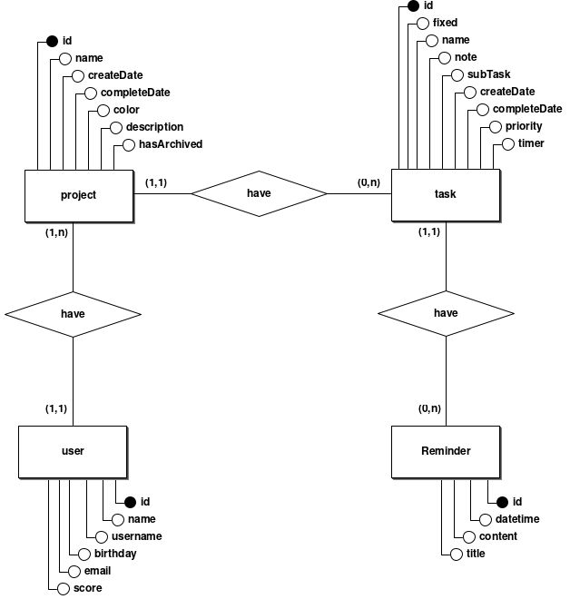

# Documento de Modelos

Neste documento temos o modelo de Dados (Entidade-Relacionamento). Temos também a descrição das entidades e o dicionário de dados.

## Modelo de Dados

Abaixo apresentamos o modelo dados (Entidade-Relacionamento) usando o **BrModelo**.

## Descrição das Entidades

A seguir temos uma breve descrição das entidades presentes no modelo e dos atributos que elas contém, assim como suas devidas finalidades.

### Entidade: User(Usuário)

A entidade usuário armazena somente informações cruciais para a descrição do agente no sistema. Dentre as informações estão nome real e nome de usuário, para simplificar a visualização no sistema. Score para definir a experiência do usuário utilizando o sistema, com uma espécie de gamificação das tarefas, para estimular o uso e a organização de tarefas. Data de nascimento para possíveis recursos que possam envolver a gamificação do sistema ou algo para “aproximar mais o sistema do usuário". O email é outra informação pertinente, através dela podemos entrar em contato e enviar notificações independente da plataforma de acesso.

### Entidade: Project(Projeto)

Um projeto é utilizado para agrupar tarefas com uma finalidade em comum, para que o usuário possa dividir em grupos menores suas pendências e objetivos, e para que possa encontrar mais facilmente tarefas correlacionadas. Ela armazena atributos como nome, descrição e cor. O objetivo da cor é para que seja possível criar categorias em que o usuário possa, visivelmente, classificar os projetos. Como exemplo, um conjunto de projetos destinados a faculdade, com finalidades diferentes.

### Entidade: Task(Tarefa)

As tarefas têm uma estrutura maior, seu principal atributo note(nota) tem tamanho indefinido, tipicamente um VARCHAR. Ele armazena o conteúdo codificado em markdown da anotação, podendo conter links, tabelas e afins. A tarefa também contém os atributos de data de criação, conclusão e o prazo para conclusão, sendo assim é possível adicionar um timer para realização da tarefa. Outro atributo que vale a pena mencionar é a prioridade, assim é possível adicionar mais uma propriedade para seleção e especificar com maior precisão as notificações a fim de diferenciá-las.

### Entidade: Reminder(Lembrete)

O fundamento do lembrete é permitir enviar de forma síncrona ou assíncrona notificações para o usuário, seja através de alertas no navegador ou e-mails. Sua estrutura particularmente simples, contém a data e hora para disparo e seu conteúdo de forma textual, até 256 caracteres.

## Dicionário de Dados

Dicionário de dados centraliza informações sobre o conjunto de dados (dataset) sob análise. Seu propósito é melhorar a comunicação entre todos os envolvidos no projeto, além de ser um repositório (documento) que descreve de forma estruturada, o significado, origem, relacionamento e uso dos dados.

## Tabela: User(Usuário)

| Atributo | Chave | Tipo de dado | Tamanho | Descrição                                     |
| -------- | :---: | :----------: | :-----: | --------------------------------------------- |
| id       |  PK   |   NUMERIC    |    4    | Identificador incremental de usuário.         |
| name     |  NN   | VARCHAR[100] |   100   | Nome real do usuário.                         |
| username |  NN   | VARCHAR[16]  |   16    | Nome para exibição do usuário.                |
| birthday |  NN   |     DATE     |    3    | Data formato (XX/XX/XXXX).                    |
| email    |  NN   | VARCHAR[256] |   256   | Email formato local-part@domain - - RFC 5322. |
| score    |  NN   |   NUMERIC    |    4    | Score para gamificação das tarefas.           |

## Tabela: Project(Projeto)

| Atributo     | Chave | Tipo de dado | Tamanho | Descrição                                      |
| ------------ | :---: | :----------: | :-----: | ---------------------------------------------- |
| id           |  PK   |   NUMERIC    |    4    | Identificador incremental de projeto.          |
| name         |  NN   | VARCHAR[100] |   100   | Nome do projeto.                               |
| description  |  NN   | VARCHAR[280] |   280   | Descrição do projeto.                          |
| createDate   |  NN   |     DATE     |    3    | Data formato (XX/XX/XXXX).                     |
| completeDate |  NN   |     DATE     |    3    | Data formato (XX/XX/XXXX).                     |
| color        |  NN   |  VARCHAR[6]  |    4    | Código Hexadecimal da cor do projeto (RRGGBB). |
| user_id      |  FK   |   NUMERIC    |    4    | Chave para um usuário.                         |

## Tabela: Task(Tarefa)

| Atributo     | Chave | Tipo de dado |  Tamanho  | Descrição                                                             |
| ------------ | :---: | :----------: | :-------: | --------------------------------------------------------------------- |
| id           |  PK   |   NUMERIC    |     4     | Identificador incremental de tarefa.                                  |
| name         |  NN   | VARCHAR[50]  |    50     | Nome do projeto.                                                      |
| fixed        |  NN   |   BOOLEAN    |     1     | Identificador de fixação do projeto.                                  |
| note         |  NN   |  VARCHAR[]   | Undefined | Nota da tarefa em markdown, com número ilimitado de caracteres.       |
| priority     |  NN   |   NUMERIC    |     4     | Prioridade da tarefa.                                                 |
| createDate   |  NN   |   DATETIME   |     8     | Data e hora formato (YYYY-MM-DD HH:MM:SS.ffffff).                     |
| completeDate |  NN   |   DATETIME   |     8     | Data e hora formato (YYYY-MM-DD HH:MM:SS.ffffff).                     |
| timer        |  NN   |   DATETIME   |     8     | Prazo para conclusão da tarefa. Formato (YYYY-MM-DD HH:MM:SS.ffffff). |
| subTask      |  FK   |   NUMERIC    |     4     | Chave para uma tarefa. (Não obrigatório)                              |
| task_project |  FK   |   NUMERIC    |     4     | Chave para um projeto.                                                |

## Tabela: Reminder(Lembrete)

| Atributo    | Chave | Tipo de dado | Tamanho | Descrição                                                           |
| ----------- | :---: | :----------: | :-----: | ------------------------------------------------------------------- |
| id          |  PK   |   NUMERIC    |    4    | Identificador incremental de Lembrete.                              |
| datetime    |  NN   |   DATETIME   |    8    | Prazo para disparar Lembrete. Formato (YYYY-MM-DD HH:MM:SS.ffffff). |
| content     |  NN   | VARCHAR[256] |   256   | Conteúdo do Lembrete.                                               |
| notify_task |  FK   |   NUMERIC    |    4    | Chave para uma tarefa.                                              |

### Referências

[Exemplo de Dicionário - IBM](https://publib.boulder.ibm.com/tividd/td/ITMFTP/GC23-4803-00/pt_BR/HTML/TMTPmst80.htm)

[Dicionário de Dados](https://www.luis.blog.br/dicionario-de-dados.html)

[Dicionário de Dados Portal Dados Abertos](https://tce.pe.gov.br/internet/docs/dadosabertos/TomeConta2017DicionarioDados.pdf)

[Definição formal da estrutura de endereço de email](https://datatracker.ietf.org/doc/html/rfc5322)
